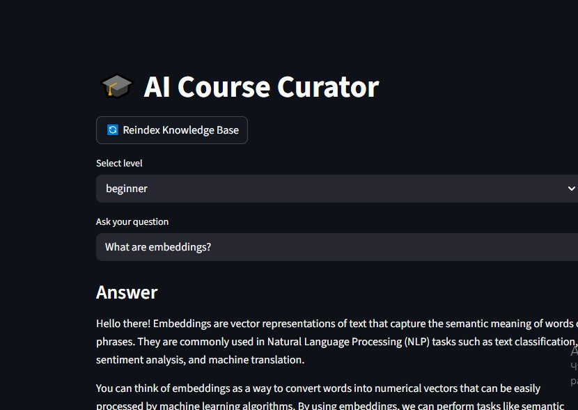
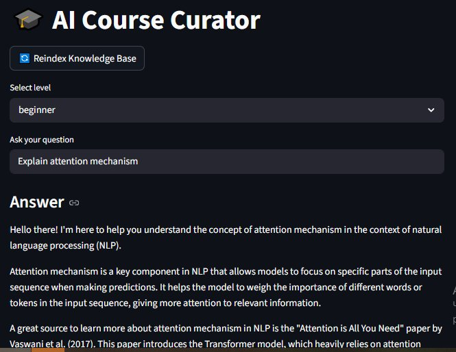

# 🎓 AI Course Curator

> RAG-ассистент для онлайн-курсов: отвечает на вопросы студентов по материалам курса, ссылаясь на источник.

[](https://www.python.org)
[](https://langchain.com)
[](https://streamlit.io)
[](LICENSE)

---

## 🎯 Задача

Онлайн-школы получают одни и те же вопросы от студентов десятки раз в день: «что такое X?», «где про это в материалах?», «когда дедлайн?». Кураторы и преподаватели тратят на это часы, которые могли бы пойти на разбор сложных кейсов.

**ИИ-куратор** снимает эту нагрузку: отвечает на типовые вопросы 24/7, ссылается на конкретные лекции и не выдумывает фактов, которых нет в материалах.

## 🏗️ Что внутри

End-to-end RAG-приложение:

- **Streamlit-интерфейс** с выбором уровня студента (beginner / advanced) и кнопкой переиндексации
- **FAISS-индекс** локальной базы знаний курса
- **LangChain-пайплайн**: загрузка `.txt`-документов → чанкинг → эмбеддинги OpenAI → векторный поиск
- **Промпт-архитектура** с реальной адаптацией под уровень студента и явными ограничениями (не выдумывает, ссылается на источник, не выходит из роли)
- **Логирование запросов** в JSON для последующей аналитики

## 🖼️ Демо

| Вопрос beginner-уровня | Вопрос advanced-уровня |
|---|---|
|  |  |

Оба ответа основаны на материалах из `data/course_docs/`, ассистент явно ссылается на источник.

## 🧱 Архитектура

```
┌─────────────────┐
│  Student        │
│  question       │
└────────┬────────┘
         │
         ▼
┌────────────────────────────────────────┐
│  Streamlit UI (app.py)                 │
│  - level selector (beginner/advanced)  │
│  - question input                      │
└────────┬───────────────────────────────┘
         │
         ▼
┌────────────────────────────────────────┐
│  RAG pipeline (rag_pipeline.py)        │
│                                         │
│  1. retrieve_context()                  │
│     FAISS similarity_search, k=3        │
│                                         │
│  2. build_prompt()                      │
│     system + level block + context      │
│                                         │
│  3. ChatOpenAI.invoke()                 │
└────────┬───────────────────────────────┘
         │
         ▼
┌─────────────────┐       ┌─────────────────┐
│  Answer + ctx   │──────▶│  logs.json      │
│  (Streamlit)    │       │  (analytics)    │
└─────────────────┘       └─────────────────┘
```

## 📂 Структура

```
ai-course-curator/
├── app.py                    # Streamlit UI
├── rag_pipeline.py           # FAISS-индекс, ретривер, генерация ответа
├── prompts.py                # Промпт-архитектура с адаптацией под уровень
├── analytics.py              # Логирование в JSON
├── requirements.txt
├── .env.example
├── data/
│   └── course_docs/          # .txt-лекции (входная база знаний)
├── vectorstore/              # FAISS-индекс (создаётся при reindex)
└── docs/
    └── screenshots/          # Скриншоты для README
```

## 🚀 Запуск

```bash
# 1. Клонировать
git clone https://github.com/q6066697/ai-course-curator.git
cd ai-course-curator

# 2. Виртуальное окружение
python -m venv venv
source venv/bin/activate    # Windows: venv\Scripts\activate

# 3. Зависимости
pip install -r requirements.txt

# 4. Ключ OpenAI
cp .env.example .env
# открой .env и впиши свой OPENAI_API_KEY

# 5. Запуск
streamlit run app.py
```

После запуска нажми **Reindex Knowledge Base** в сайдбаре — приложение проиндексирует тексты из `data/course_docs/` и будет готово к вопросам.

## 🧠 Промпт-архитектура

Главное отличие от «промпт в одну строку»:

- **Системный промпт** задаёт роль, ограничения и тон: не выдумывать, ссылаться на источник, не выставлять оценок и не менять дедлайны
- **Адаптация под уровень** — реальная, не декоративная. В `prompts.py` на каждый уровень свой блок инструкций: для beginner — определять термины, бытовые аналогии, разбивать на шаги; для advanced — компактно, профессиональная терминология, trade-offs
- **Контекст из RAG** передаётся отдельным блоком, чтобы модель чётко понимала, на что опираться

Полный промпт собирается в `prompts.build_prompt(question, context, level)`.

## 📊 Логирование

Каждый запрос пишется в `logs.json`:

```json
{
  "timestamp": "2026-04-27T22:37:58",
  "level": "beginner",
  "question": "What are embeddings?",
  "response": "...",
  "context_length": 105
}
```

Это даёт основу для будущего дашборда: топ-темы, распределение по уровню, частые «промахи» (когда `context_length` маленький).

## 🛠️ Что я узнал на этом проекте

1. **RAG ≠ просто «закинуть всё в FAISS».** Качество ответа сильнее зависит от чанкинга и формулировки промпта, чем от выбора модели.
2. **Уровень студента надо вшивать в инструкцию, а не передавать как метку.** Первая версия принимала `level`, но в промпте использовала её как `Level: {level}` — модель эту строчку игнорировала. После явного блока `LEVEL_BLOCKS` ответы для beginner и advanced стали реально различаться.
3. **`temperature=0` для куратора — правильный дефолт.** Креативность здесь не нужна, нужна предсказуемость.
4. **Логирование пишется до того, как становится нужным.** Когда понадобятся метрики, поздно идти и добавлять логи.

## 🛣️ Roadmap

Это первая итерация. Приоритеты для v2:

- [ ] **Two-pass архитектура:** дешёвый классификатор намерения (learning / organizational / support / out-of-scope / forbidden) + специализированный промпт под каждый сценарий. Это удешевит запросы и улучшит безопасность.
- [ ] **Метаданные в чанках** (модуль, лекция, уровень) и фильтрация при retrieve. Сейчас все чанки в одном индексе без структуры.
- [ ] **Миграция с JSON-логов на SQLite** + Plotly-дашборд (топ-тем, доля «не нашлось», стоимость в USD).
- [ ] **Eval-набор** из 20–30 эталонных вопросов с метриками: точность ссылки на источник, корректность отказов от out-of-scope, удержание роли при джейлбрейках.
- [ ] **Локальные эмбеддинги** (`bge-m3`) для удешевления и работы оффлайн.

## 🤝 Лицензия

[MIT](LICENSE)

---

**Автор:** [Alex K.](https://github.com/q6066697) · [Telegram](https://t.me/AllAllAis) · [Сайт](https://n8nmind.site)
